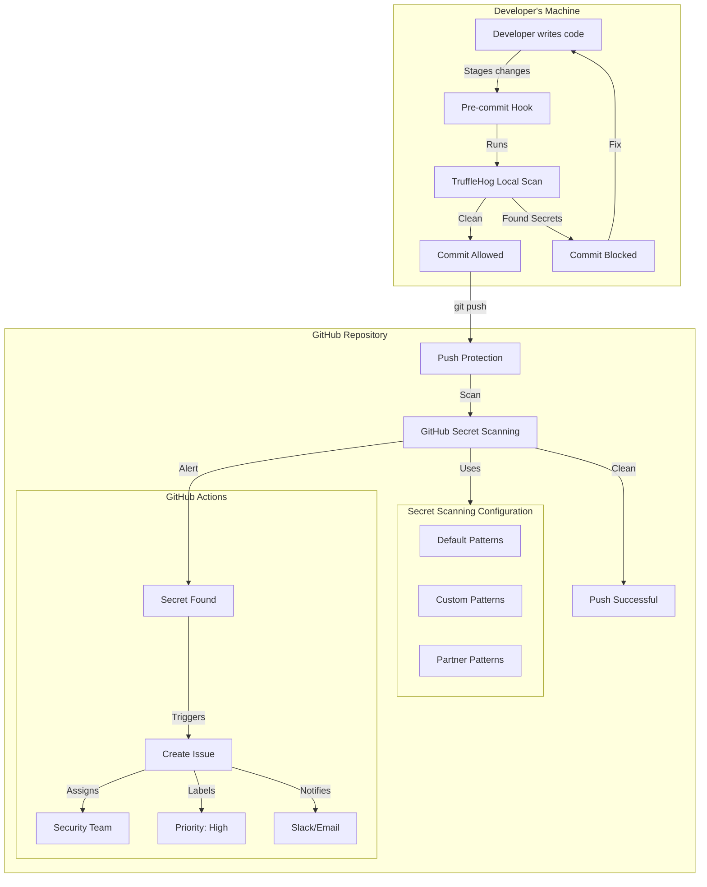

# Globomantics Secret Scanning Sandbox 🤖

> DevSecOps demonstration of GitHub Advanced Security secret scanning with custom patterns and automated response workflows.

[](https://github.com/timothywarner-org/globomantics-secret-scanning-sandbox/actions/workflows/test-secret-alert.yml)

## Secret Scanning Flow



## Key Components

1. **[Custom Pattern](.github/workflows/test-globo-secret-pattern.yml)**: `gbot-(dev|prod)-[A-Fa-f0-9]{16}` - [See format doc](globomantics-robot-auth-token-formats.md)
2. **[Alert Handler](.github/workflows/secret-alert-handler.yml)**: Creates labeled issues with remediation steps
3. **[Pre-commit Hook](.hooks/pre-commit)**: Local TruffleHog scanning

## Quick Test

```bash
# Run the test suite
./run-secret-test.sh

# Or trigger manually
gh workflow run test-secret-alert.yml
```

## Alert Response

Automated issue creation with:
- 🏷️ Smart labels (`security`, `priority:high`, `globomantics`)
- 📋 Location and severity details
- ✅ Remediation checklist
- 🔔 Optional Slack notifications

## Learn More

- [Secret Scanning Docs](https://docs.github.com/code-security/secret-scanning)
- [Custom Pattern Guide](https://docs.github.com/code-security/secret-scanning/defining-custom-patterns-for-secret-scanning)
- [Pluralsight: GitHub Advanced Security](https://www.pluralsight.com/authors/tim-warner)

---
*For Pluralsight GitHub Advanced Security course materials*
